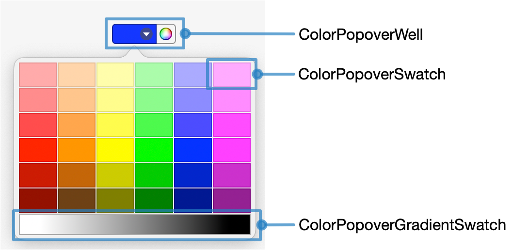

# ColorPopoverWell (a Modern NSColorWell)

Shortly after I started using iWork (Pages, Numbers, Keynote), I noticed that the apps had an updated color well for selecting colors:


Selecting the color wheel on the right would show the color panel, and selecting the area on the left would show a palette of common useable colors.  I was thrilled when I saw this because until this time the NSColorWell seemed like the one part of macOS that had never gotten a macOS facelift on the path from NeXTStep to macOS.

The color handling in AppKit was very advanced and a dream for those who needed detailed control over color, but the user interface was a bit mysterious and not inviting for the average user.  Previously, to see the color panel, you had to click on the frame of the NSColorWell, which was not very intuitive at all.  And the default way to select a color was the NSColorPanel, which had a color wheel which wasn't straightforward for beginners to understand.

<figure>
<p align="center">

</p>
<figcaption align = "center"><b> Traditional NSColorWell in macOS.  This is the same look and feel as NeXTStep and OpenStep </b></figcaption>
</figure>

<figure>
<p align="center">

</p>
<figcaption align = "center"><b> NSColorPanel from an earlier version of macOS </b></figcaption>
</figure>


I had assumed that this was a preview of a newer NSColorWell that would show up in the next version of macOS, but it never showed.  So, I ended up taking some time to construct one that worked in the same way as I saw in iWork.  This work was done in Objective-C around 2008.  

In macOS Ventura NSColorWell finally got the first facelift since the original NeXTStep version, and although it had elements similar to the iWork version it is not as pleasant.

I've decided to update my version from Objective-C to Swift, as well as document how it works.  This document walks through the newer Swift source code, and the updated and original design goals.


# The Design

I started by putting together a set of screenshots and bullet points about how the control should work, as well as making a diagram of the overall code areas that would need to be completed.

All the classes are subclasses of NSView, so a simple diagram shows which classes represent each drawn component.

As this project is several years old, I don't have any of the original screenshots or other material, so here is a screenshot from the last working Objective-C class.

<figure>
<p align="center">

</p>
<figcaption align = "center"><b> Callouts of ColorPopoverWell in use </b></figcaption>
</figure>

The diagram helps give an idea of what features are necessary for the overall project, and the relationship between them.

<figure>
<p align="center">

</p>
<figcaption align = "center"><b> Diagram of the code separation </b></figcaption>
</figure>


### Bullet points of operation:

* Divided into two sides
* Right Side
	* Hovering should gently light the right area to invite the user to click 
	* Clicking on the right side should show the regular NSColorPanel.
* Left Side
	* Hovering should show a graphical indicator that clicking will show a popover
	* Clicking should show the popover
	* Allow dragging the color out just as a normal NSColorWell
	* When dragging into the well, border the left side.
* Popover
	* Preselected colors arranged in a grid
	* At the bottom, a quick way to select white and black, as well as any shade of grey from a gradient.

Since I was copying an existing design, I also played with the iWork examples a great deal to fine tune my expectation.  I ended up extracting image assets from Pages and using them as the basis for the Objective-C version.  For a personal project, this was fine, but for a commercial product or shared source code it would be inappropriate to reuse graphics that belong to someone else.  The newer Swift version no longer uses these assets.


These assets actually resulted in several design deficiencies that I fixed in the Swift version.

* The design is a fixed size
* The design assumes a fixed Aqua (blue) highlight

For the Swift version the layout was redone using [PaintCode](https://www.paintcodeapp.com), and the document is included as part of the repository.  PaintCode allows you to draw a vector shape with controls and generate the corresponding Objective-C or Swift code.  

# ColorPopoverWell
As I mentioned earlier, this view assumes that a fixed size was an acceptable design criteria. This is memorialized by the one comment in the entire file, which is the required size of the view.

The wheelRect and colorRect are variable computed on each call based on the bounds of the view.  These represent the left and right side of the control.

Because the view drawing changes based on hover or the user clicking on portions of the view, a set of booleans track the current drag, track and hovering states

Finally, the view has an instance variable for the popover so that once created it can be reused without reading the XIB again.

```swift
public class ColorPopoverWell: NSColorWell {
  // 66 x 23
  var wheelRect:.....
  var colorRect:.....
  var acceptingDrag: Bool = false
  var showColorHover: Bool = false
  var showColorTrack: Bool = false
  var showWheelHover: Bool = false
  var showWheelTrack: Bool = false
  lazy var popover: ....
```

## Instance  Initialization
This is pretty straightforward covering both initialization by frame and coder.  A small post initialization method sets up the instance rectangles, current frame image, as well as enables tracking on the view.

```swift
  public override init(frame frameRect: NSRect) {
    super.init(frame: frameRect)
    postSetup()
  }

  public required init?(coder: NSCoder) {
    super.init(coder: coder)
    postSetup()
  }

  func postSetup() {

    let track = NSTrackingArea.init(rect: bounds,
        options: [.mouseEnteredAndExited, .mouseMoved, .activeInKeyWindow, .inVisibleRect],
        owner: self,
        userInfo: nil)
    addTrackingArea(track)
  }

```

## Mouse Tracking
Whenever the mouse enters, leaves or moves inside the bounds, the frame image needs to be updated.

```swift
  func updateTrack(with event: NSEvent) {
    let currentPoint = convert(event.locationInWindow, from: nil)
    if (NSMouseInRect(currentPoint, wheelRect, isFlipped)) {
      showColorHover = false
      showWheelHover = true
    } else if (NSMouseInRect(currentPoint, colorRect, isFlipped)) {
      showColorHover = true
      showWheelHover = false
    } else {
      showColorHover = false
      showWheelHover = false
    }
    needsDisplay = true
  }

  public override func mouseEntered(with event: NSEvent) {
    updateTrack(with: event)
  }

  public override func mouseMoved(with event: NSEvent) {
    updateTrack(with: event)
  }

  public override func mouseExited(with event: NSEvent) {
    updateTrack(with: event)
  }

```

## Drawing
The drawing code was simplified by the use of PaintCode.  The only magic here is some support for 10.13 by allow the use of hilightColor instead of accentColor which was introduced in 10.14

```swift
  public override func draw(_ dirtyRect: NSRect) {
    if #available(macOS 10.14, *) {
      PaintCode.drawPopoverWell(frame: bounds, accentColor: .controlAccentColor, color: color, showDropIndicator: acceptingDrag, showColorHover: showColorHover, showColorTrack: showColorTrack, showWheelHover: showWheelHover, showWheelTrack: showWheelTrack, showWheelActive: isActive)
    } else {
      PaintCode.drawPopoverWell(frame: bounds, accentColor: .highlightColor, color: color, showDropIndicator: acceptingDrag, showColorHover: showColorHover, showColorTrack: showColorTrack, showWheelHover: showWheelHover, showWheelTrack: showWheelTrack, showWheelActive: isActive)
    }
  }
```


When the user clicks on some other NSColorWell in the application, a message is sent to deactivate this color well.  This is handled by this method:

```swift
  public override func deactivate() {
    super.deactivate()
    needsDisplay = true
  }
```

The status of acceptingDrag is set by the standard mouse tracking methods:

```swift
  public override func draggingEntered(_ sender: NSDraggingInfo) -> NSDragOperation {
    acceptingDrag = true
    needsDisplay = true
    return super.draggingEntered(sender)
  }

  public override func draggingExited(_ sender: NSDraggingInfo?) {
    acceptingDrag = false
    needsDisplay = true
    return super.draggingExited(sender)
  }

  public override func prepareForDragOperation(_ sender: NSDraggingInfo) -> Bool {
    acceptingDrag = false
    needsDisplay = true
    return super.prepareForDragOperation(sender)
  }
```


## The Popover
Creation of the popover is standard code, creating it from the XIB file and positioning it below the view if possible.

```swift
  func showColorPopop() {
    popover.show(relativeTo: colorRect, of: self, preferredEdge: .minY)
  }

```

## Mouse Down

The mouse down determines whether the user is clicking in the left half or the right half.   The else-return should never execute, but is in place in case the view is the wrong size.

```swift
  public override func mouseDown(with startEvent: NSEvent) {
    let startPoint = convert(startEvent.locationInWindow, from: nil)

    if (NSPointInRect(startPoint, wheelRect)) {
      showWheelTrack = true
      needsDisplay = true;
    } else if (NSPointInRect(startPoint, colorRect)) {
      showColorTrack = true
      needsDisplay = true
    } else {
      return
    }
```

Like any other mouse down tracking code, a loop waits for the mouse button to be lifted and updating the state when the mouse moves:

```swift
 var loopEvent: NSEvent? = startEvent

    repeat {
...
    } while (loopEvent != nil && loopEvent!.type != .leftMouseUp)
    showWheelTrack = false
    showColorTrack = false
    needsDisplay = true
```

There are three outcomes of the user clicking. 

* They drag and begin dragging a small color chit. (this is the normal NSColorWell experience)
* They click and release the mouse in the wheel area.  If this well is not active it becomes active and will deactivate the other wells unless the shift key is held down.  If this well is active then it deactivates
* They click and release the mouse in the color area in which case the popover is shown

The dragging is detected by determining the distance between the starting point (mouse down) and the current point (mouse dragged), and if it exceeds 3 points in any direction the drag is started ad then tracking loop exits.

```swift
        let currentPoint = convert(loopEvent!.locationInWindow, from: nil)
        if (abs(currentPoint.x - startPoint.x) > 3.0 || abs(currentPoint.y - startPoint.y) > 3.0) {
          needsDisplay = true
          NSColorPanel.dragColor(color, with: loopEvent!, from: self)
```

Otherwise the mouse up conditions are handled:

```swift
          if (loopEvent?.type == .leftMouseUp) {
            if (NSMouseInRect(currentPoint, wheelRect, isFlipped)) {
              if (isActive) {
                deactivate()
              } else {
                activate(!(loopEvent!.modifierFlags.contains(.shift)))
              }
            } else if (NSMouseInRect(currentPoint, colorRect, isFlipped)) {
              showColorPopop()
            }
            needsDisplay = true
          }
```
# ColorPopoverSwatch
The easiest of the classes to walk through is the color swatch.  

<figure>
<p align="center">

</p>
<figcaption align = "center"><b> 6x6 grid of ColorPopoverSwatch </b></figcaption>
</figure>

The popover is created by loading a XIB file when the user clicks on the left side of the color well. The preset colors are created by dragging an NSView to the window and changing the class to ColorPopoverSwatch.

<figure>
<p align="center">

</p>
<figcaption align = "center"><b> Setting the Custom Class for NSView </b></figcaption>
</figure>

The color for each is then set using the User Defined Runtime Attributes
<figure>
<p align="center">

</p>
<figcaption align = "center"><b> Setting the Color </b></figcaption>
</figure>

And each swatch is connected to the File's Owner which will be the NSViewController:
<figure>
<p align="center">

</p>
<figcaption align = "center"><b> Connecting to File's Owner </b></figcaption>
</figure>


The class has one additional piece of state, whether the mouseDown loop is currently tracking the mouse, in which case a border is drawn when the user has clicked on the swatch and is still inside the bounds:

```swift
internal class ColorPopoverSwatch: NSView {

  @IBInspectable var color: NSColor = .clear
  var tracking: Bool = false
  var controller: NSViewController?
```

The drawing code is pretty straight forward.  The color is set an the entire bounds is filled.  A small dark border is drawn around the edge by compositing a rectangle with a low alpha.  This created a subtle frame that matches the main color.

If the mouseDownLoop is tracking then a frame with a thicker accent color border is drawn.

```swift
  override func draw(_ dirtyRect: NSRect) {
    color.set()
    color.drawSwatch(in: bounds)

    NSColor.init(calibratedWhite: 0.0, alpha: 0.1).set()
    bounds.frame(withWidth: 1.0, using: .plusDarker)

    if (tracking) {
      if #available(macOS 10.14, *) {
        NSColor.controlAccentColor.set()
      } else {
        NSColor.highlightColor.set()
      }
      bounds.frame(withWidth: 2.0, using: .sourceOver)
    }
  }

```


The tracking code is a straight forward tracking loop.  As the mouse is moved a determination is made as to whether the mouse is still inside the bounds.  If so then tracking is set to YES and if not then tracking is set to NO.  Whenever the state of tracking changes the swatch is redrawn.  When the mouse button is no longer pressed the color is sent to the color well if the mouse was inside the bounds.

```swift
  override func mouseDown(with startEvent: NSEvent) {
    tracking = true
    needsDisplay = true

    var loopEvent: NSEvent? = startEvent
    repeat {
      loopEvent = window?.nextEvent(matching: [.leftMouseDragged, .leftMouseUp],
          until: .distantFuture,
          inMode: .default,
          dequeue: true)
      if (loopEvent != nil) {
        let currentPoint = convert(loopEvent!.locationInWindow, from: nil)
        if NSMouseInRect(currentPoint, bounds, isFlipped) {
          if (!tracking) {
            tracking = true
            needsDisplay = true
          }
        } else if (tracking) {
          tracking = false
          needsDisplay = true
        }
      }
    } while (loopEvent != nil && loopEvent!.type != .leftMouseUp)

...
    tracking = false
    needsDisplay = true
  }
```

The final part of the mouseDown is what actually sets the original color well to show the updated color as well as notify the target and action of the color well of the change. 

```swift
    if (tracking) {
      let well = controller?.representedObject as! ColorPopoverWell
      well.selectedColor(color)
    }
```
# ColorPopoverGradientSwatch

The gradient swatch is similar to the color swatch but allows any color between black and white.

Clicking on the far left will select pure white.  Clicking on the far right will select black.  Clicking anywhere in the middle gradient will select that gray value.

The user can also drag inside the gradient to tune the gray selection. 

<figure>
<p align="center">

</p>
<figcaption align = "center"><b> Gradient Selection </b></figcaption>
</figure>

Like the popover swatch there is a relation to the controller to update the selected color. 

The left and right color are defined in the XIB file.  Since they are white and black they could have been hardcoded with `[NSColor whiteColor]` and `[NSColor blackColor]`.  They were defined as instance variables, because when I started writing this class I had a vague idea of allowing the user to pick two colors and use the gradient to pick between them.  This was never completed, but I may add it to a later version.

When the user has pressed the mouse down and is dragging the view needs to emphasize the leftRect, rightRect, or gradientRect.  

# Review and Future Directions

Overall I was pretty pleased with how this came out.  It acts very similar to the one in iWork.  I feel it works better than the updated version in macOS Ventura.

A big advantage of subclassing NSColorWell is that all the other features of NSColorWell work with this subclass such as the selection of multiple color wells, bindings, and drag and drop.

Some plans for future improvements:

* Add tool tips and accessibility features
* Allow users and developers to set the color palette including editing, loading, saving and quickly moving between palettes
* Allow users to set the start and end color for the gradients to make a mix of colors
* Add an option for "no color".  This is a common need in drawing programs to indicate that an object should not be filled with a color at all but rather left transparent.


----
Karl Kraft
karl@karlkraft.com
