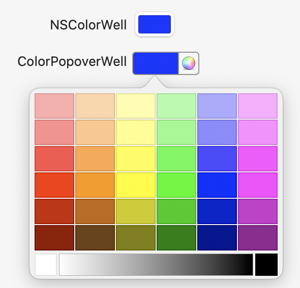
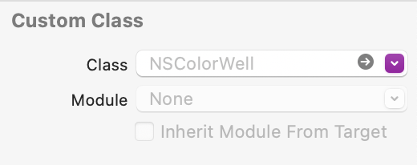
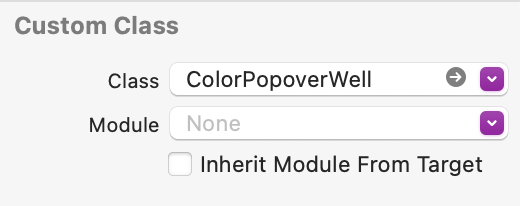

# ColorPopoverWell

ColorPopoverWell is a drop in replacement for NSColorWell that allows users to either select a color from the color panel in the same was as NSColorWell or from a series of convient swatches.

<figure>

<figcaption align = "center"><b>Screenshot with swatch view displayed</b></figcaption>
</figure>

To upgrade from the plain boring NSColorWell to ColorPopoverWell you only need to change the custom class in the Xcode Interface Builder and add the Swift package to your project.  How easy is that?

| Before      | After |
| ----------- | ----------- |
|       |        |

## Features
* Sublassed from NSColorWell, so can be used as a drop in replacement.
* Full cooperation with NSColorWell
* Drawn in vectors for full retina support and any size (66x23 is the "default" size)
* Drag and drop of color swatches with feedback on drops
* Gradient selection

